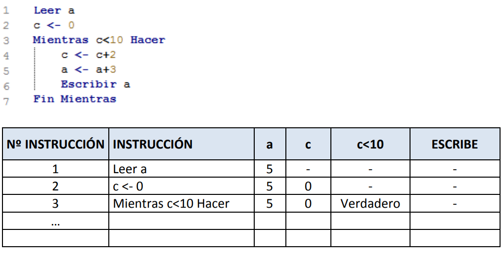

# Unidad 1. Elementos de un programa informático.

```{r, include = FALSE}
library(knitr)
```


```{r, include = FALSE}
knitr::opts_chunk$set(echo = TRUE)
```

## Resumen del contenido.

## Ejercicios.

### Ejercicios-I. Algoritmos iniciales (pseudocódigo)


__1.- Construir un algoritmo que tome como dato de entrada un número que corresponde a la longitud de un radio y nos calcula y escribe la longitud de la circunferencia, el área del círculo y el volumen de la esfera.__


$l=2*pi*r$  
$a=pi*r2$  
$v=4/3*pi*r3$  


Solución con pseudocódigo

"./pseudo_code_exercises/ud_1_ejercicio_1.psc"

```{r , warning= FALSE, message= FALSE, eval = FALSE}
Algoritmo calculos_radio
	
	Escribir "Ingrese la longitud del radio:"
    Leer A
	
	l <- 2*3.1416*A
	a <- 3.1416*A^2
	v <- (4/3)*3.1416*A^3
	
	Escribir "La longitud de la circunferencia es: ",l
	Escribir "El área de la circunferencia es: ",a
	Escribir "El volumen de la esfera es: ",v
	
FinAlgoritmo
```

Solución con R

```{r , warning= FALSE, message= FALSE}

calculos_radio <- function(r) {
  
  l = 2*pi*r
  a = pi*r**2
  v = (4/3)*pi*r**3
  
  print(c(l, a, v))
}

calculos_radio(3)

```

Solución con Python

```{python}

import math

def calculos_radio(r):
  
  l = 2*math.pi*r
  a = math.pi*r**2
  v = (4/3)*math.pi*r**3
  
  print(l, a, v)


calculos_radio(3)

```


__2.- Construir un algoritmo que leído un número por teclado nos diga si es positivo, negativo o nulo.__


Solución con pseudocódigo

```{r , warning= FALSE, message= FALSE}


```

Solución con R

```{r , warning= FALSE, message= FALSE}


```

Solución con Python


__3.- Construir un algoritmo para calcular y escribir la suma de los 100 primeros números naturales. Utilizar las estructuras PARA, MIENTRAS Y REPETIR.__

Solución con pseudocódigo

```{r , warning= FALSE, message= FALSE}


```

Solución con R

```{r , warning= FALSE, message= FALSE}


```

Solución con Python


__4.- Construir un algoritmo para sumar independientemente los números pares y los impares comprendidos entre 1 y 100. Visualizar los resultados.__ 

Solución con pseudocódigo

```{r , warning= FALSE, message= FALSE}


```

Solución con R

```{r , warning= FALSE, message= FALSE}


```

Solución con Python


__5.- Construir un algoritmo que leídos tres números introducidos por teclado me visualice el mayor.__

Solución con pseudocódigo

```{r , warning= FALSE, message= FALSE}


```

Solución con R

```{r , warning= FALSE, message= FALSE}


```

Solución con Python


__6.- Construir un algoritmo para visualizar los N primeros múltiplos de 4, donde N es un número que se lee por teclado.__

Solución con pseudocódigo

```{r , warning= FALSE, message= FALSE}


```

Solución con R

```{r , warning= FALSE, message= FALSE}


```

Solución con Python


__7.- Construir un algoritmo para introducir una serie de números, que finaliza al leer el número 0. Una vez que ha finalizada la captura de números queremos saber cuantos había mayores, iguales y menores que 50.__

Solución con pseudocódigo

```{r , warning= FALSE, message= FALSE}


```

Solución con R

```{r , warning= FALSE, message= FALSE}


```

Solución con Python


__8.- Escribir un algoritmo que lea una temperatura en grados Fahrenheit y escriba su equivalente en grados centígrados C=(F-32)*5/9__


Solución con pseudocódigo

```{r , warning= FALSE, message= FALSE}


```

Solución con R

```{r , warning= FALSE, message= FALSE}


```

Solución con Python


__9.- Hacer un algoritmo que calcule el sueldo neto semanal de un trabajador a partir de la lectura de las horas trabajadas y el precio por hora. Para el cálculo del sueldo neto hay que tener en cuenta los siguientes datos:__  

- Las primeras 35 horas se pagan al precio dado (precio normal).  
- Las horas que pasen de 35 se pagan a 1,5 de la tarifa normal.    
- Las tasas de impuestos son:  

  o Los primeras 5000€ son libres de impuestos.  
  o Entre 5000€ u 10000€ tienen un impuesto del 5%.  
  o Lo que sobrepase de 10000€ tiene un impuesto del 15%.  

Solución con pseudocódigo

```{r , warning= FALSE, message= FALSE}


```

Solución con R

```{r , warning= FALSE, message= FALSE}


```

Solución con Python


__10.- Diseñar el algoritmo de un programa que lee un número entero positivo y determina el número
de dígitos necesarios para la representación de ese valor.__

Solución con pseudocódigo

```{r , warning= FALSE, message= FALSE}


```

Solución con R

```{r , warning= FALSE, message= FALSE}


```

Solución con Python


### Ejercicios-II. Algoritmos - Pseudocódigo

__11.- Imaginemos que queremos desarrollar un algoritmo tal que al escribir un día de la semana aparezca por pantalla la actividad extraescolar a la que debe acudir nuestro hijo. Por ejemplo, si ejecutamos el programa y escribimos martes que aparezca “natación”.__

Las actividades que se realizan por días son:
lunes: psicomotricidad jueves: natación
martes: natación viernes: descanso
miércoles: música

Los días sábado y domingo no se realizan actividades con lo que si el usuario escribe por error alguno
de estos días de la semana se debe mostrar el mensaje: “Día sin actividades”. Si por equivocación,
además se escribe un día inexistente se debe mostrar en pantalla “Día erróneo”.
Tener en cuenta las mayúsculas, minúsculas y tildes. No es lo mismo lunes que Lunes, ni miércoles
que miercoles. Esto es así porque el carácter ‘l’ es distinto del carácter ‘L’ en el código ASCII que es el
que se usa para representarlos.

Solución con pseudocódigo

```{r , warning= FALSE, message= FALSE}


```

Solución con R

```{r , warning= FALSE, message= FALSE}


```

Solución con Python


__12.- Para realizar la traza se ha de hacer un seguimiento de los valores que toman las variables simulando manualmente la ejecución del algoritmo, es decir, siguiendo el flujo de ejecución del mismo.__
__Haz la traza del siguiente programa e indica qué valores toman las variables y qué escribe, suponiendo que a "a" se le da el valor 5. Continúa rellenando la tabla.__
```{r , warning= FALSE, message= FALSE, out.width = "300px", out.height = "250px"}

```

Solución con pseudocódigo

```{r , warning= FALSE, message= FALSE}


```

Solución con R

```{r , warning= FALSE, message= FALSE}


```

Solución con Python


__13.- Realiza un algoritmo que nos indique si un año determinado es bisiesto, debemos pedir al usuario el año. Un año es bisiesto si es múltiplo de 4, a excepción de los que siendo múltiplos de 4 también son múltiplos de 100 pero no de 400.__

Solución con pseudocódigo

```{r , warning= FALSE, message= FALSE}


```

Solución con R

```{r , warning= FALSE, message= FALSE}


```

Solución con Python


__14.- Realiza un algoritmo que pida al usuario una hora en elementos separados (hora 0-23, minutos 0-59 y segundos 0-59). A continuación se debe mostrar por pantalla qué hora será pasado un minuto.__

Solución con pseudocódigo

```{r , warning= FALSE, message= FALSE}


```

Solución con R

```{r , warning= FALSE, message= FALSE}


```

Solución con Python


__15.- Realiza la traza de seguimiento del ejercicio anterior. Usa valores extremos, por ejemplo 23 horas 59 minutos 10 segundos, o 0 horas 3 minutos y 59 segundos o las 5 horas 59 minutos 24 segundos.__

Solución con pseudocódigo

```{r , warning= FALSE, message= FALSE}


```

Solución con R

```{r , warning= FALSE, message= FALSE}


```

Solución con Python


__16.- Realiza un algoritmo que dé solución al cálculo del factorial de un número entero.__
__n! = n x (n-1) x (n-2) x … x 1 Realiza una versión con un bucle PARA y otra con un bucle MIENTRAS.__

Solución con pseudocódigo

```{r , warning= FALSE, message= FALSE}


```

Solución con R

```{r , warning= FALSE, message= FALSE}


```

Solución con Python


__17.- Realiza un algoritmo que dé solución al problema de calcular la multiplicación de dos números mediante el uso de sumas sucesivas.__

Solución con pseudocódigo

```{r , warning= FALSE, message= FALSE}


```

Solución con R

```{r , warning= FALSE, message= FALSE}


```

Solución con Python


__18.- Realiza un algoritmo que pida dos números X e Y de forma que se pretende calcular $X^Y$ suponiendo que no existe el operador de potencia.__
            __X puede ser cualquier número entero distinto de 0.__
            __Y puede ser cualquier entero positivo, negativo o nulo.__
            
__(Recuerda que $X^0 =1, X-Y=1/X^Y$)__

Solución con pseudocódigo

```{r , warning= FALSE, message= FALSE}


```

Solución con R

```{r , warning= FALSE, message= FALSE}


```

Solución con Python


__19.- Algoritmo que lea un valor entero que represente la posición ordinal de un mes (1,2,...12) y nos diga cuantos días tiene ese mes, o un mensaje de error si el valor del mes es incorrecto. Para febrero se indicará 28 o 29 días.__


Solución con pseudocódigo

```{r , warning= FALSE, message= FALSE}


```

Solución con R

```{r , warning= FALSE, message= FALSE}


```

Solución con Python


__20.- Diseñar un algoritmo para jugar a la adivinanza de números. El ordenador generará un número al azar, entre 0 y 15, y el usuario tendrá que adivinar cuál es. Se dispondrá de todas las oportunidades que quiera y el programa tendrá que ir diciendo si se ha pasado o se quedó corto en cada intento. Finalmente cuando consiga acertarlo se deberá mostrar un mensaje de felicitación y el número de intentos que necesitó. Para generar el número al azar supondremos una función AZAR(x) que genera un número aleatorio entre 0 y x-1.__

__Como al menos se deberá de repetir una vez el intento de acierto, es más adecuado una estructura REPETIR ..HASTA/MIENTRAS. En cada repetición se pide al usuario el número y se compara con el que hay que acertar, incrementando el número de intentos. Con una estructura SI se comprueba si se pasó, se quedó corto o lo acertó. La condición de salida de REPETIR será que se haya acertado.__

Solución con pseudocódigo

```{r , warning= FALSE, message= FALSE}


```

Solución con R

```{r , warning= FALSE, message= FALSE}


```

Solución con Python


### Ejercicios-III. Programación modular.

__21.- Dados dos valores numéricos reales almacenados en dos variables de nombre a y b, hacer un programa que llame a una función de nombre Cambiar(v1, v2) a la que se le pasan como parámetros dichas variables e intercambia sus valores, mostrando el resultado.__

Solución con pseudocódigo

```{r , warning= FALSE, message= FALSE}


```

Solución con R

```{r , warning= FALSE, message= FALSE}


```

Solución con Python


__22.- Escribe un programa con diseño modular que recoja por teclado dos números reales y presente una serie de opciones correspondientes a operaciones aritméticas a realizar con las mismas:__

1. Sumar
2. Restar
3. Multiplicar
4. Dividir
En función de la operación elegida, se llama a la función correspondiente que retorna el valor del resultado de dicha operación, que se muestra en el programa principal.

Solución con pseudocódigo

```{r , warning= FALSE, message= FALSE}


```

Solución con R

```{r , warning= FALSE, message= FALSE}


```

Solución con Python


__23.- Escribir un programa que utilice una función recursiva para calcular y retornar la potencia de un número real distinto de cero, siendo su exponente entero y positivo.__

Xn = X * X n-1 
X0 = 1 
 
 Solución con pseudocódigo

```{r , warning= FALSE, message= FALSE}


```

Solución con R

```{r , warning= FALSE, message= FALSE}


```

Solución con Python


 
__24.- Realizar un programa que disponga de una función llamada esBisiesto que reciba un año y devuelva cierto si es bisiesto y falso si no lo es. Realizado en el Ejercicio 13: Los años que sean divisibles por 4 serán bisiestos; aunque no serán bisiestos si son divisibles entre 100 (como los años 1700, 1800, 1900, 2100) a no ser que sean divisibles por 400 (como los años 1600, 2000, 2400).__

Solución con pseudocódigo

```{r , warning= FALSE, message= FALSE}


```

Solución con R

```{r , warning= FALSE, message= FALSE}


```

Solución con Python


__25.- Construir un algoritmo que calcule el número “e”, la base de los logaritmos neperianos, calcular a partir de la siguiente aproximación:__
                e= 1 + 1/1! + 1/2! +1/3! + …… + 1/N!
__siendo N un número entero positivo mayor que 10 que se pedirá por teclado. Utilizar una función para calcular los factoriales correspondientes a los denominadores de los términos.__

Solución con pseudocódigo

```{r , warning= FALSE, message= FALSE}


```

Solución con R

```{r , warning= FALSE, message= FALSE}


```

Solución con Python


